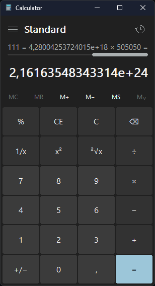
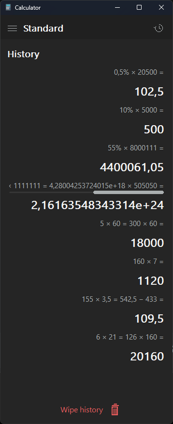

<p align="center">
  
</p>

<h1 align="center">Persistent Calculator</h1>

<p align="center">
  A compact, dark Windows Standard calculator with full calculation chains, permanent local history, and secure automatic updates.
</p>

<p align="center">
  <a href="https://github.com/Garries420/Persistent-Calculator/releases/latest"><strong>Download the latest release</strong></a>
</p>

## Screenshots

| Calculator | Persistent history |
|---|---|
|  |  |

## Features

- Familiar Windows Calculator-inspired dark Standard layout.
- Addition, subtraction, multiplication, division, decimals, sign changes, reciprocal, square, square root, and percentages.
- Google-style percentage calculations: `20 % 100 = 20` is preserved as `20% × 100 = 20`.
- Traditional percentage calculations remain supported, such as `50 + 10% = 55`.
- Complete calculation chains remain visible instead of being replaced by intermediate totals.
- Long active expressions and history expressions have draggable horizontal scrollbars.
- Result text automatically shrinks to fit instead of being replaced with `...`.
- Results can be selected with a custom gray highlight, right-clicked, and copied.
- Permanent, human-readable calculation history stored locally as a text file.
- Clicking a history entry restores both its result and preserved calculation chain.
- Continuing a restored calculation updates the same working history session.
- Operator-completed calculations can be saved without requiring Enter; for example, `11 + 11 + 11 +` records `33`.
- Mouse-wheel scrolling remains vertical inside the History panel.
- Red **Wipe history** button with a bin icon.
- Memory controls: MC, MR, M+, M−, MS, and the saved-memory popup.
- Remembers its last screen position, window size, and maximized state.
- Keyboard input, Enter/equals, Backspace, Delete/CE, Escape/C, and clipboard shortcuts.
- A five-second update-status popup checks the public GitHub release on every startup.
- Manual **Check for updates** control and current version display in the hamburger menu.
- Secure automatic updates verify GitHub's SHA-256 release-asset digest before launching anything.
- Portable single-executable release: no installer and no bundled personal history.

## Standard mode only

Persistent Calculator intentionally focuses on the normal **Standard calculator** experience. It currently does **not** include the extra modes and converters available in Microsoft Calculator, such as:

- Scientific, Graphing, and Programmer modes
- Date calculation
- Currency conversion
- Volume, Length, Weight and mass, and Temperature conversion
- Energy, Area, Speed, Time, Power, Data, Pressure, or Angle conversion

These additional modes may be added in future versions depending on user feedback and which features people actually request. Suggestions are welcome through the repository's [Issues page](https://github.com/Garries420/Persistent-Calculator/issues).

## Download and use

1. Download `PersistentCalculator.exe` from the [latest GitHub release](https://github.com/Garries420/Persistent-Calculator/releases/latest).
2. Place it anywhere your Windows account can write to, such as Downloads, Desktop, or a personal applications folder.
3. Run the EXE. No installation is required.

The project does not ship with anyone else's calculation history. Each Windows user gets a separate local text file when the calculator first runs.

> Windows SmartScreen may warn about a newly downloaded build because the project does not currently have a paid code-signing certificate. Release SHA-256 values are published beside every EXE, and the built-in updater verifies GitHub's asset digest before installing an update.

## Where the history text file is created

The calculator creates:

```text
%USERPROFILE%\Documents\Windows Calculator Saved History.txt
```

More precisely, it uses Windows' configured **Documents** known folder, so systems that redirect Documents to OneDrive or another location will use that redirected folder. It creates a text file—not a new folder.

- The file contains calculation expressions and results only.
- It is readable in Notepad.
- **Wipe history** empties it.
- Deleting it manually is also safe; an empty file is created the next time the calculator starts.
- The file is never uploaded by the calculator or included in GitHub releases.

Window placement is stored separately under `HKEY_CURRENT_USER\Software\PersistentCalculator`. That registry value contains only window coordinates, size, and maximized state.

## Updates and privacy

On startup, the calculator performs one HTTPS `GET` request to the public `Garries420/Persistent-Calculator` latest-release endpoint. It sends no calculation history, clipboard contents, filenames, account information, or telemetry.

When a newer stable release exists, the calculator:

1. Downloads only the exact `PersistentCalculator.exe` release asset.
2. Requires the download URL to belong to this repository's GitHub Releases path.
3. Calculates the downloaded file's SHA-256 hash.
4. Compares it with GitHub's release-asset digest.
5. Cancels the update if any verification fails.
6. Replaces and restarts the calculator only after verification succeeds.

See [PRIVACY.md](PRIVACY.md) and [SECURITY.md](SECURITY.md) for more detail.

## Useful keyboard controls

| Action | Keyboard |
|---|---|
| Digits and operators | `0–9`, `+`, `-`, `*`, `/`, `%` |
| Decimal separator | `.` or `,` |
| Calculate | `Enter` or `=` |
| Clear current entry | `Delete` |
| Clear calculation | `Escape` |
| Remove last digit | `Backspace` |
| Copy selected/full result | `Ctrl+C` |
| Paste a number | `Ctrl+V` |
| Open/close history | `Ctrl+H` |

## Building from source

The release build uses the Microsoft C compiler available with Visual Studio Build Tools:

```bat
scripts\build-release.cmd
```

The script runs the calculation-engine tests, updater-parser security tests, compiles the resources/icon, and produces `dist\PersistentCalculator.exe` with the static Microsoft C runtime.

Every push to the public `main` branch is rebuilt by GitHub Actions. A release is created only when the version in `VERSION` does not already have a matching release tag.

## Development and releases

- Public repository: stable source, public feedback, and downloadable releases.
- Development/testing occurs privately before a finished version is copied to the public `main` branch.
- Stable releases use semantic versions such as `1.0.0`, `1.1.0`, and `2.0.0`.

## License

Persistent Calculator is available under the [MIT License](LICENSE).
