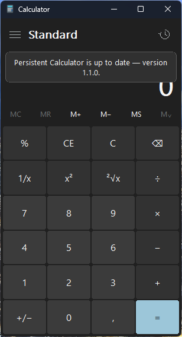
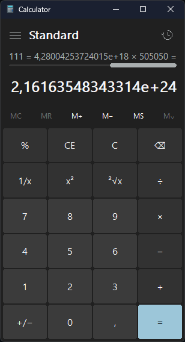
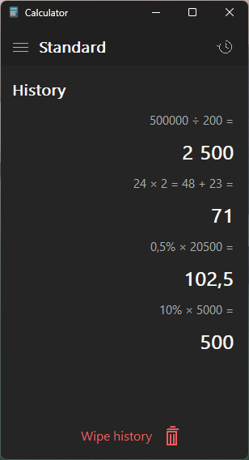
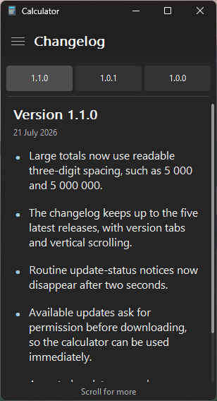

<p align="center">
  
</p>

<h1 align="center">Persistent Calculator</h1>

<p align="center">
  <a href="https://github.com/Garries420/Persistent-Calculator/releases/tag/v2.0.0"></a>
  
</p>

<p align="center">
  A compact, dark Windows calculator with permanent local history and secure, user-approved updates.
</p>

<p align="center">
  <a href="https://github.com/Garries420/Persistent-Calculator/releases/latest"><strong>Download the latest release</strong></a>
</p>

## Screenshots

| Update status | Calculator |
|---|---|
|  |  |
| **Persistent history** | **Changelog** |
|  |  |

## Features

- Familiar Windows Calculator-inspired dark layout.
- Google-style percentage calculations: `20 % 100 = 20` is preserved as `20% × 100 = 20`.
- Traditional percentage calculations remain supported, such as `50 + 10% = 55`.
- Results can be selected with a custom gray highlight, right-clicked, and copied.
- Permanent, human-readable calculation history stored locally as a text file.
- Clicking a history entry restores both its result and preserved calculation chain.
- Continuing a restored calculation updates the same working history session.
- Red **Wipe history** button with a bin icon.
- Remembers its last screen position, window size, and maximized state.
- Manual **Check for updates** control and current version display in the hamburger menu.
- Built-in scrollable **Changelog** screen retains up to the five latest releases.
- Portable single-executable release: no installer and no bundled personal history.

## Calculator modes

- Standard
- Scientific
- Programmer
- Date calculation
- Currency
- Volume
- Length
- Weight and mass
- Temperature
- Energy
- Area
- Speed
- Time
- Power
- Data
- Pressure
- Angle

Graphing is not included yet, but it may be added in the future. If a mode needs improvement or you would like another feature, please use the repository's [Issues page](https://github.com/Garries420/Persistent-Calculator/issues).

Currency conversions use daily reference rates from [Frankfurter](https://frankfurter.dev/currencies/).

## Download and use

1. Download `PersistentCalculator.exe` from the [latest GitHub release](https://github.com/Garries420/Persistent-Calculator/releases/latest).
2. Place it anywhere your Windows account can write to, such as Downloads, Desktop, or a personal applications folder.
3. Run the EXE. No installation is required.

The project does not ship with anyone else's calculation history. Each Windows user gets a separate local text file when the calculator first runs.

> Windows SmartScreen may warn about a newly downloaded build because the project does not currently have a paid code-signing certificate. Release SHA-256 values are published beside every EXE, and the built-in updater verifies GitHub's asset digest before installing an update.

## Where the local data files are created

The calculator creates these files in your configured **Documents** folder:

```text
%USERPROFILE%\Documents\Windows Calculator Saved History.txt
%USERPROFILE%\Documents\Windows Calculator Currency Rates.json
```

More precisely, it uses Windows' configured Documents known folder, so systems that redirect Documents to OneDrive or another location will use that redirected folder. It creates files—not a new folder.

- `Windows Calculator Saved History.txt` contains calculation expressions and results only. It is readable in Notepad, **Wipe history** empties it, and deleting it manually is safe.
- `Windows Calculator Currency Rates.json` contains cached currency rates from Frankfurter and the time they were gathered. Deleting it manually is safe; it is recreated when currency rates are needed.
- Neither file is uploaded by the calculator or included in GitHub releases.

Window placement is stored separately under `HKEY_CURRENT_USER\Software\PersistentCalculator`. That registry value contains only window coordinates, size, and maximized state.

## Updates and privacy

On startup, the calculator performs one HTTPS `GET` request to the public `Garries420/Persistent-Calculator` latest-release endpoint. It sends no calculation history, clipboard contents, filenames, account information, or telemetry.

When a newer stable release exists, the calculator:

1. Shows the current and available versions and asks whether to update.
2. Downloads nothing unless **Yes, update** is selected. Choosing **No, not now** keeps the calculator open and asks again on the next startup or manual check.
3. Downloads only the exact `PersistentCalculator.exe` asset from this repository's GitHub Releases path.
4. Shows generic download, verification, and installation progress without exposing user paths.
5. Calculates the downloaded file's SHA-256 hash and compares it with GitHub's release-asset digest.
6. Cancels the update if any verification fails.
7. Replaces and restarts the calculator only after verification succeeds.

See [PRIVACY.md](PRIVACY.md) and [SECURITY.md](SECURITY.md) for more detail.

## Building from source

The release build uses the Microsoft C compiler available with Visual Studio Build Tools:

```bat
scripts\build-release.cmd
```

The script runs the calculation-engine tests, updater-parser security tests, compiles the resources/icon, and produces `dist\PersistentCalculator.exe` with the static Microsoft C runtime.

Every push to the public `main` branch is rebuilt by GitHub Actions. A release is created only when the version in `VERSION` does not already have a matching release tag.

## License

Persistent Calculator is available under the [MIT License](LICENSE).
