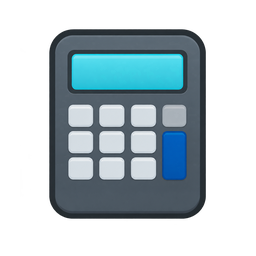
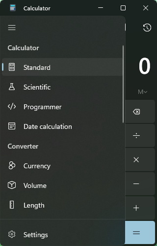
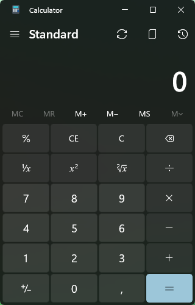
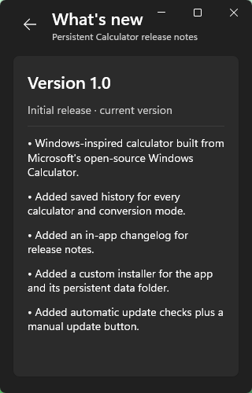
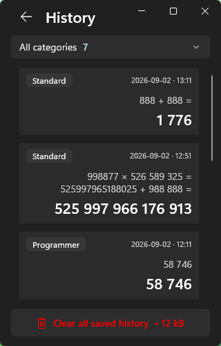
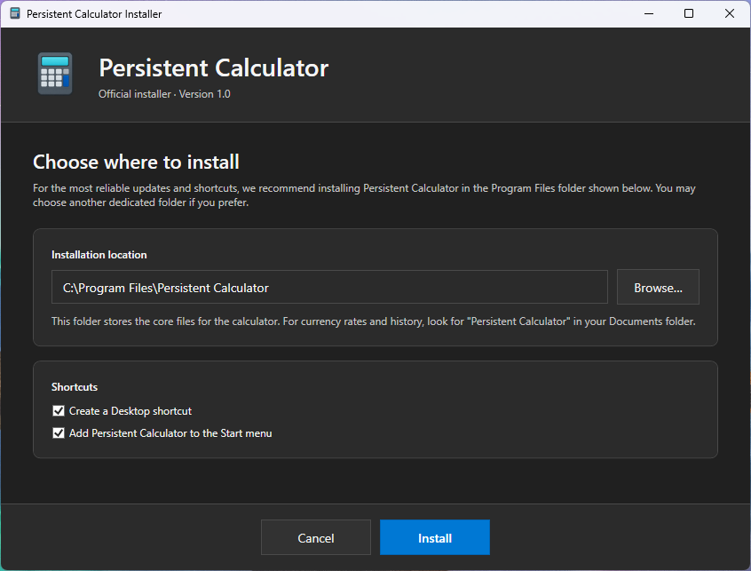

  
  <h1>Persistent Calculator</h1>
<!-- security-status:start -->
  
  &nbsp;&middot;&nbsp;
  
  &nbsp;&middot;&nbsp;
   VirusTotal Pending
  &nbsp;&middot;&nbsp;
   Kaspersky OpenTIP: Pending
<!-- security-status:end -->

## Screenshots

  
  
   
  
  

## Features

- Familiar Windows style calculator with dark and white theme
- History tab with filtration for each conversion type
- Clicking a history entry restores its preserved calculation chain
- History stored locally in `Documents\Persistent Calculator`
- Red button to wipe the history
- Changelog tab for past versions
- Physical button to check for updates (it also runs an auto check on each startup)
- Currency conversions use daily reference rates from [Frankfurter](https://frankfurter.dev/).

## Download & Installation & Uninstall

1. Download the Persistent Calculator installer `.exe` from the [latest GitHub release](https://github.com/Garries420/Persistent-Calculator/releases/latest).
2. Run the `.exe` and choose installation folder and hit install
3. Run the desktop `.exe` shortcut that the installer created or run it from the start menu
4. If you want to uninstall the calculator, there is a uninstall program inside the installation folder

  

If installation fails, copy the last entries or use **Download entries**, then attach the file to an [issue](https://github.com/Garries420/Persistent-Calculator/issues).

Windows UAC or Microsoft Defender SmartScreen may show a warning. If the installer came from this repository, choose **Run anyway** to continue.

## Frankfurters & History

[Frankfurter](https://frankfurter.dev/) provides daily currency exchange-rate data. Currency rates and `History.txt` are stored in `Documents\Persistent Calculator`.

Uninstalling the calculator does not remove these files; remove them manually if you no longer want them.

## License

Persistent Calculator is an independent fork of Microsoft's open-source Windows Calculator. It is not affiliated with or endorsed by Microsoft. The project is available under the [MIT License](LICENSE).
